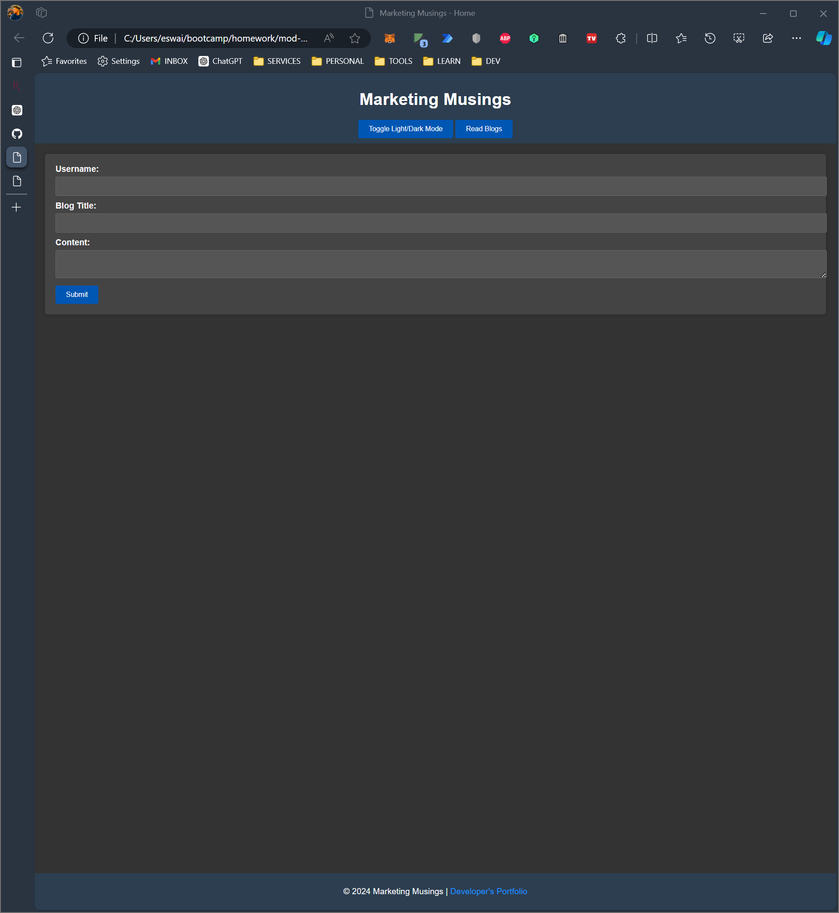

# [Module 4] Web APIs: Marketing Musings

## What I Learned From This Project

This project involved building a two-page personal blog application using JavaScript, focusing on handling user inputs, manipulating the DOM, and using `localStorage` for data persistence. It provided practical experience in creating interactive web applications with light and dark mode themes, enhancing both the user interface and user experience.

# Project Overview

Marketing Musings is a personal blog application that allows marketing students to input and view blog posts. The application runs in the browser and features a clean, polished, and responsive user interface, including a light/dark mode toggle to improve accessibility and user comfort.

## Details

The project requirements were:

- **Creating a responsive user interface** using HTML, CSS, and JavaScript
- **Handling user inputs** through a form to capture blog posts
- **Storing blog post data** in `localStorage` for persistence
- **Implementing a light/dark mode toggle** for improved user experience
- **Validating form inputs** to ensure all fields are completed before submission

## Requirements

The following criteria defined the scope of this assignment:

  
Agile Project Management Considerations

#### 1. User Story:

    AS A marketing student
    I WANT a personal blog
    SO THAT I can showcase my thoughts and experiences

#### 2. Acceptance Criteria:

    GIVEN a personal blog
    WHEN I load the app,
    THEN I am presented with a landing page containing a form with labels and inputs for username, blog title, and blog content.
    WHEN I submit the form,
    THEN blog post data is stored to localStorage.
    WHEN the form submits,
    THEN I am redirected to the posts page.
    WHEN I try to submit a form without a username, title, or content,
    THEN I am presented with a message that prompts me to complete the form.
    WHEN I view the posts page,
    THEN I am presented with a header, a light mode/dark mode toggle, and a "Back" button.
    WHEN I click the light mode/dark mode toggle,
    THEN the page content's styles update to reflect the selection.
    WHEN I click the "Back" button,
    THEN I am redirected back to the landing page where I can input more blog entries.
    WHEN I view the main content,
    THEN I am presented with a list of blog posts that are pulled from localStorage.
    WHEN I view localStorage,
    THEN I am presented with a JSON array of blog post objects, each including the post author's username, the title of the post, and the post's content.
    WHEN I take a closer look at a single blog entry in the list,
    THEN I can see the title, the content, and the author of the post.
    WHEN I view the footer,
    THEN I am presented with a link to the developer's portfolio.

#### 3. Mockup:

    The following images show the web application's appearance and functionality:

#### 4. Instructions for Submission:

    You are required to submit BOTH of the following for review:

    - The URL of the deployed application.
    - The URL of the GitHub repository that contains your code. Give the repository a unique name and include a README file that describes the project.
    

## Submission
GitHub repo
    - https://github.com/Iggys4ur/mod-04_marketing-musings

Hosted Webpage
    - https://iggys4ur.github.io/mod-04_marketing-musings

---

# Installation

To run this project locally, (assuming you have git installed) input the following code in your terminal:

`git clone https://github.com/Iggys4ur/mod-04_marketing-musings.git <PATH_TO_DESTINATION_DIRECTORY>`

# Usage

The live site may be viewed at the following URL:

- https://iggys4ur.github.io/mod-04_marketing-musings/

  
Screenshot of the pages

    
index.html 
blog.html 
  

&nbsp;

# Credits

I used the following resources to complete this project:

- [RU Full Stack Coding Bootcamp Curriculum](https://bootcamp.rutgers.edu/)
- Various forums and documentation, including:
  - [Stack Overflow](https://stackoverflow.com/)
  - [Reddit](https://reddit.com/)
  - [GitHub Community Discussions](https://github.com/orgs/community/discussions/)
  - [W3Schools JavaScript](https://w3schools.com/js/)
  - [MDN Web Docs](https://developer.mozilla.org/)

# License

This project is licensed under the MIT License. For more information, read the LICENSE file.

---
